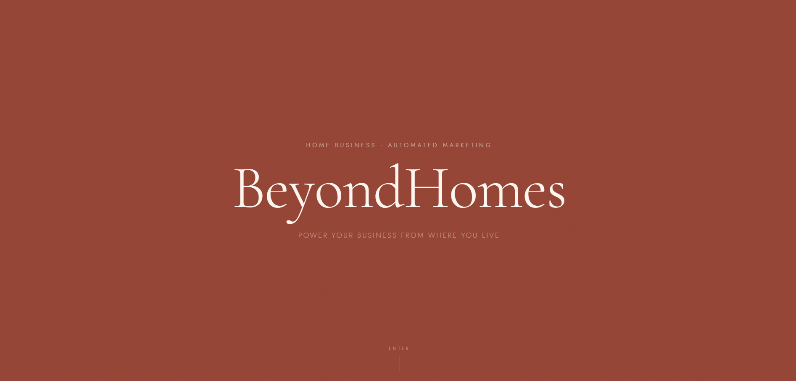
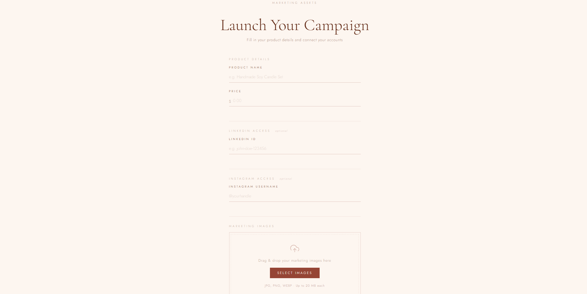
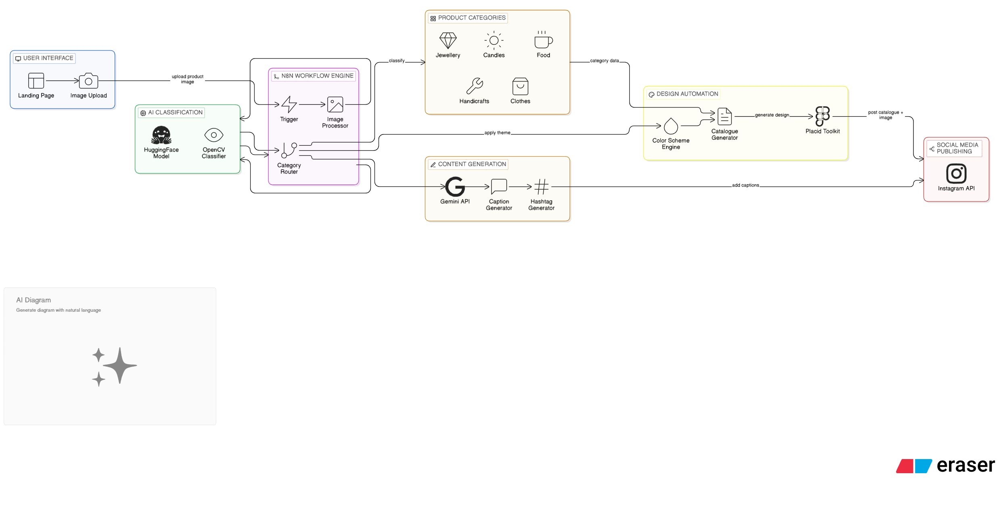
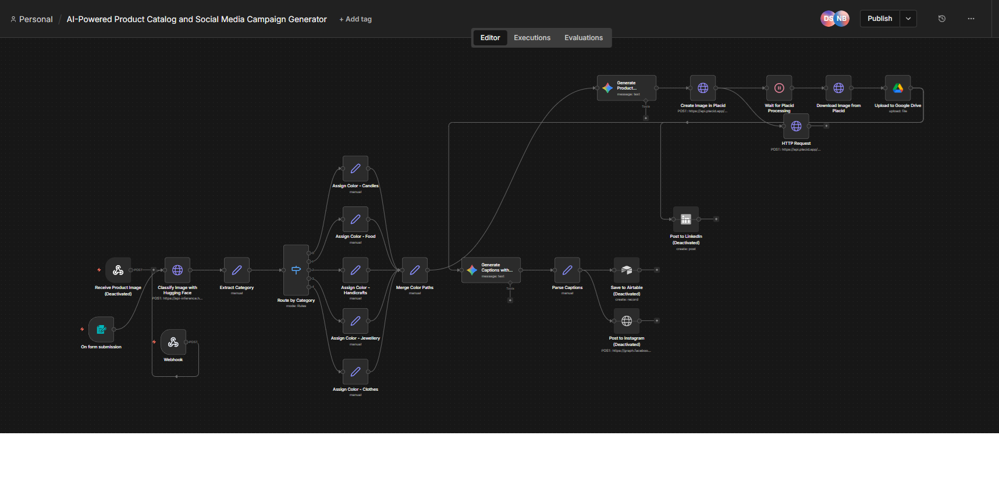

# BeyondHomes 🎯

---

# Basic Details  

**Team Name:** CodeRose

## Team Members  

- Member 1: Diya S Nair – MITS, Kochi  
- Member 2: Neha Biju - MITS, Kochi

---

## Hosted Project Link  


---

# Project Description  

BeyondHomes is an end-to-end marketing automation platform for home-based businesses and micro-entrepreneurs. It transforms a simple product image into a branded catalogue and automatically generates and posts AI-powered captions to social media platforms.

---

# The Problem Statement  

Home-based businesses and micro-entrepreneurs struggle with managing digital inventory, designing professional catalogues, writing engaging captions, and posting consistently on platforms like Instagram and LinkedIn while maintaining brand consistency.

---

# The Solution  

BeyondHomes automates the entire marketing workflow. Users upload a product image, which is classified using AI, themed automatically, converted into a marketing-ready catalogue, paired with AI-generated captions, and auto-posted to social media platforms — all through a seamless automation pipeline.

---

# Technical Details  

## Technologies/Components Used  

### For Software:

**Languages used:**  
- HTML  
- CSS  
- JavaScript  

**Frameworks used:**  
- n8n (Workflow Automation Engine)

**Libraries used:**  
- HuggingFace (Image Classification Model)  
- Gemini API (Caption & Hashtag Generation)  
- Placid Automation Toolkit  

**Tools used:**  
- Placid.app (Design automation)

---

# Features  

- **Feature 1:** One-click product image upload via web interface  
- **Feature 2:** AI-based product categorization and dominant color extraction  
- **Feature 3:** Automatic themed catalogue generation based on product type  
- **Feature 4:** AI-powered caption and hashtag generation for Instagram & LinkedIn  
- **Feature 5:** Fully automated cross-platform social media posting  

---

# Implementation  

## For Software:

### Installation  

```bash
# Add installation commands here
# Example:
# npm install
# Configure environment variables
# Add API keys for HuggingFace, Gemini

---

## Screenshots (Add at least 3)

  
Landing Page of BeyondHomes

  
Marketing Credentials after login

  
n8n workflow of the system

---

# Diagrams

## System Architecture:

  
The architecture of BeyondHomes powers a fully automated, AI-driven product marketing pipeline. When a user uploads a product image, the n8n workflow triggers AI classification (via Hugging Face and OpenCV) to identify the product category. Based on this classification, the system applies tailored design themes and automatically generates a branded catalogue using the design automation engine. In parallel, the Gemini API creates engaging captions and relevant hashtags. The final catalogue image and content are then seamlessly published to Instagram—transforming a single product upload into a ready-to-share, on-brand social media post in minutes.

### Architecture Flow:

Landing Page (Image Upload)  
⬇  
n8n Automation Workflow  
⬇  
HuggingFace Model → Product Classification & Color Extraction  
⬇  
Theme Selection Logic  
⬇  
Catalogue Generation (Canva / Placid)  
⬇  
Gemini Caption Generation  
⬇  
Auto Post to Instagram & LinkedIn APIs  

---

## Application Workflow:

  

### Workflow Steps:

1. User uploads product image  
2. Image sent to automation pipeline  
3. AI classifies category and extracts dominant color  
4. Theme selected based on category  
5. Catalogue auto-generated  
6. Captions generated using Gemini  
7. Content auto-posted to Instagram & LinkedIn  

---

# Team Contributions

- Diya S Nair: Workflow design, API integration  
- Neha Biju: UI design, AI model integration

---

# License

This project is licensed under the **MIT License** — see the LICENSE file for details.

---
